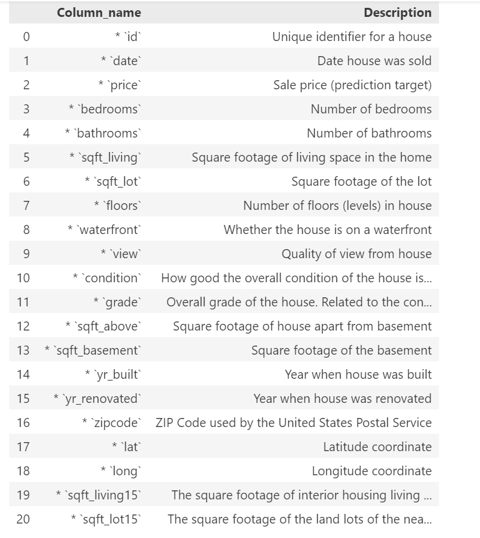
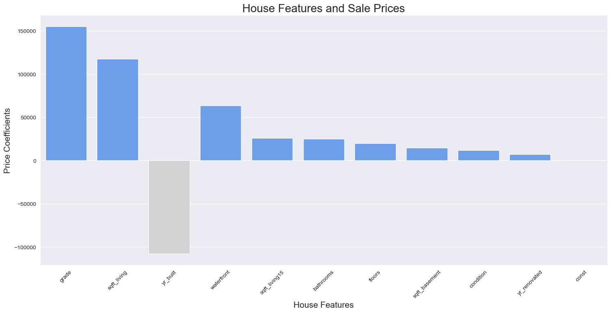
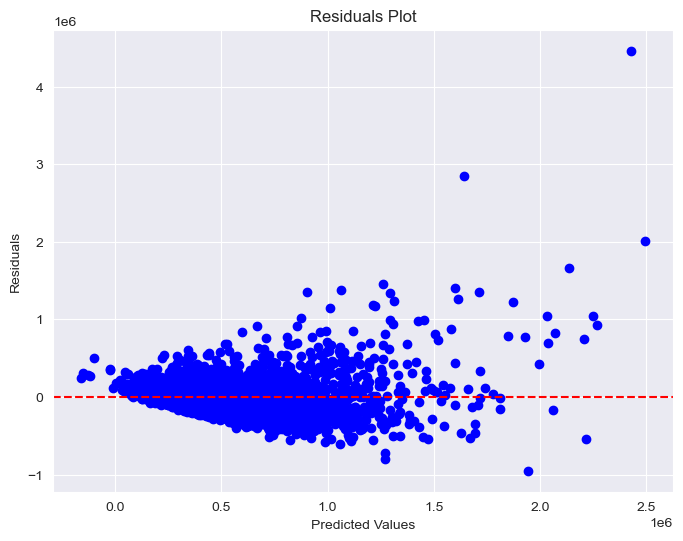
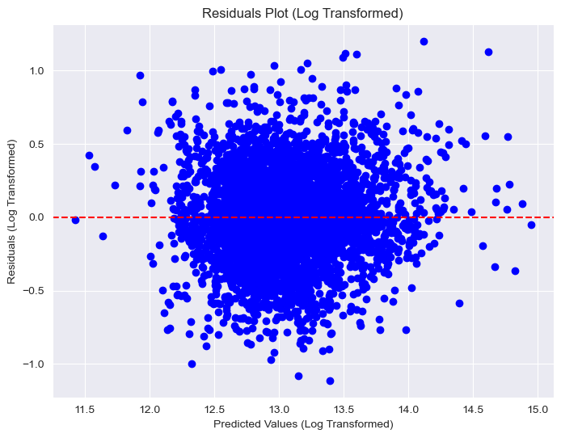

# REAL ESTATE SALES PREDICTION MODEL

## Project Overview

In the fast-paced world of real estate, it's crucial for agencies to provide clients with precise information. Clients, whether they're looking to become homeowners or investors, rely on real estate companies for guidance on important decisions such as pricing, market trends, and property evaluations. To meet this need, real estate agencies can benefit from a sophisticated regression-based tool. This tool uses various property variables like the number of bedrooms, year built, floor count, living area, condition, location, and amenities to accurately predict property prices. By employing regression analysis, agencies can offer clients more precise pricing estimates, leading to better-informed decisions. Ultimately, this tool aims to improve client satisfaction, streamline decision-making processes, and drive success for real estate agencies.

### Business Problem

Real estate experts in King County need help understanding what factors influence property values and market trends. This study aims to analyze property features, locations, buyer preferences, and market changes over time. By gaining insights from this analysis, real estate professionals can make informed decisions about buying, selling, and positioning themselves in the dynamic King County market. The goal is to provide practical advice to help them succeed in this ever-changing real estate landscape.

### The Data Understanding

King County, Washington, situated in the northwest of the United States, is known for its vibrant housing market centered around Seattle. The county has experienced significant growth due to its strong economy and cultural importance, attracting a large number of residents and creating high demand for housing in both urban and suburban areas. Seattle, with its impressive skyline, is especially sought after by tech professionals and city lovers. King County's real estate market is competitive, offering a range of neighborhoods to suit different preferences, from historic areas to modern suburban developments

**Target Variable**
price: Sale price of the house .

**Property Characteristics:**

**Main Objective:**

The primary aim of this project is to develop a predictive regression model to support real estate agencies in advising clients on house prices. This model is intended to anticipate potential changes in property value based on property characteristics, furnishing clients with valuable insights to facilitate informed investment decisions.

#**Statistical Analysis**
Statistical analysis plays a crucial role in understanding relationships within datasets, identifying patterns, and gaining insights. In this regression modeling project aimed at predicting property values, several key steps in statistical analysis are essential:

1. Descriptive Statistics
2. Correlation matrix
3. Distribution Analysis
4. Inferential Statistics using Hypothesis Testing and Analysis of Variance
5. MultiColinierity

# **Modelling**

1. Baseline model - simple linear model.
2. log transformation. 
3. Multiple Linear Regression
4. Residual modelling.

# **REGRESSION RESULTS**

**SIMPLE LINEAR REGRESSION** 
R-squared (0.48): Indicates that approximately 48% of the variability in house prices is explained by the square footage of living space. It measures how well the model captures patterns in the data.
Mean Squared Error (MSE) (68845100756.11): Represents the average squared difference between actual and predicted house prices. Lower values indicate better accuracy, but here, the MSE is quite large, suggesting room for improvement.
Root Mean Squared Error (RMSE) (262383.50): This is the square root of the MSE, providing a measure of typical deviation between predicted and actual house prices. The RMSE is approximately 262,383.50 units.
Intercept (540631.16): Estimated house price when all independent variables are zero. It's around 540,631.16 units, suggesting a baseline value.
Coefficient (259767.82): Represents the change in house prices for a one-unit increase in square footage of living space, with other variables held constant. For every one-unit increase in square footage, house prices are expected to increase by approximately 259,767.82 units.

# **Multiple Linear Regresion**

# **RESIDUALS**

A p-value of 3.975373048166964e-258, which is extremely close to zero, indicates strong evidence against the null hypothesis of homoscedasticity. In other words, there is a significant presence of heteroscedasticity in your data.
We can see the positive correlation between the house prices and all other features except the year built which indicates a negative correlation.

# **Log transformation**.
Transforming the dependent variable or one or more independent variables can sometimes stabilize the variance. Common transformations include taking the natural logarithm, square root, or reciprocal of the variables.

*Log transformation of the multiple linear regression.*

# **REGRESSION Results**

From all the models observed,We can see the positive correlation between the house prices and all other features except the year built which indicates a negative correlation.

Polynomial Regression is the preferred model beacuse from the evaluation it has the highest R-squared value of 0.73

The features below impact price such that an increase will cause an increase in the price of the property. 'bedrooms','bathrooms', 'sqft_living','floors', 'waterfront','view''condition', 'grade', 'sqft_above','sqft_basement', 'yr_renovated', 'sqft_living15','renovated', 'basement'

**Limitations**
1. The dataset could have more property based characteristics
2. Multicollinearity:The presence of correlated predictors (e.g., square footage and number of bedrooms) can lead to multicollinearity issues, making it challenging to interpret the individual effects of each feature accurately
3. Assumption Violations:Polynomial regression assumes linearity between predictors and the target variable, which may not hold true in all cases. Violations of this assumption can lead to biased estimates and unreliable predictions.
4. Overfitting: Polynomial regression models, particularly those with high degrees, are susceptible to overfitting, where the model fits the training data too closely and may not generalize well to unseen data.
Overall the model was the best fit model for this predictions

# **RECOMENDATIONS**

1.Invest in Larger Properties: Investors seeking maximum returns should focus on larger houses, as there's a positive correlation between total square footage and price. Such properties have the potential for higher profits upon resale or rental.

2.Upgrade Existing Properties: Homeowners can increase their property's value by investing in upgrades that increase square footage, such as adding extra rooms or expanding living spaces.

3.Optimize Bedroom and Bathroom Ratios: It's essential to find the right balance between bedrooms and bathrooms to maximize property value. Consulting with real estate professionals can help determine the optimal ratio based on market trends and buyer preferences.

4.Focus on Quality Over Quantity: Prioritize quality improvements that enhance functionality and aesthetics, such as renovating bathrooms with modern fixtures or upgrading kitchen appliances, to add perceived value to the property.

5.Highlight Features in Listings: Emphasize the number of bedrooms and bathrooms in property listings to attract buyers who prioritize space and convenience. Highlight unique features that add versatility to the property.

6.Differentiate Marketing Strategies: Tailor marketing strategies based on property condition and grade ratings. Highlight the benefits of higher-grade properties to attract premium buyers, while emphasizing renovation potential for properties with lower condition ratings.

# **Conclusion**

1. Property Size Matters: There is a clear positive correlation between the size of a property, indicated by total square footage, and its price. Investing in larger properties can potentially yield higher returns for investors and increase market value for homeowners.

2. Strategic Upgrades Add Value: Upgrading existing properties with strategic renovations and expansions, particularly those that increase square footage, can enhance their market value. Quality improvements that improve functionality and aesthetics are key to maximizing property value.

3. Balance is Key: While adding extra bedrooms and bathrooms can increase a property's price, there's a point of diminishing returns. It's important to strike a balance between quantity and quality, optimizing the bedroom-to-bathroom ratio to align with market trends and buyer preferences.

4. Marketing Differentiation is Essential: Tailoring marketing strategies based on property condition and grade ratings is crucial. Highlighting the unique features and benefits of higher-grade properties can attract premium buyers, while emphasizing renovation potential for properties with lower ratings can appeal to savvy investors.
